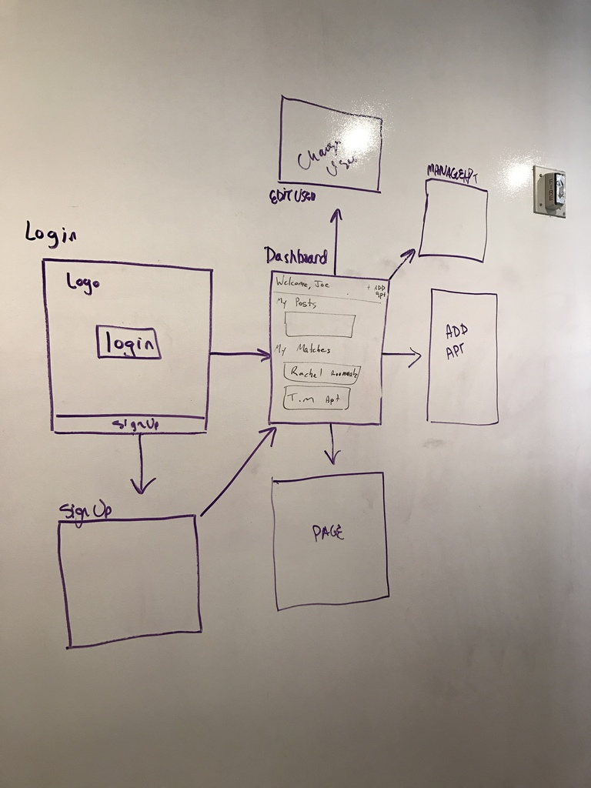

# House Keys
A roomate finder using React.js &amp; Express.js

## Roles:
  - Rachel: Front-End
  - Jon: Front-End
  - Tim: Back-End
  - Joe: Back-End

## Internal Style:
- Single quotes
- Descriptive variables
- Lots of comments

## Post Params:
- Roommate Post:
  - Smoker (Boolean): Yes/No
  - Sleep: Before 10? Around 10? After Midnight?
  - Rent (Integer)
- Apartment Post:
  - Address
  - Rent
  - Description
  - Photos

## User Stories:
- User should be able to:
  - Create an account
  - Login/logout
  - Set preferences
  - Create a post
  - Search for apartments/roomates
  - View each post
  - Edit/Delete all posts
  - Email 'matches'

## Wireframes:

